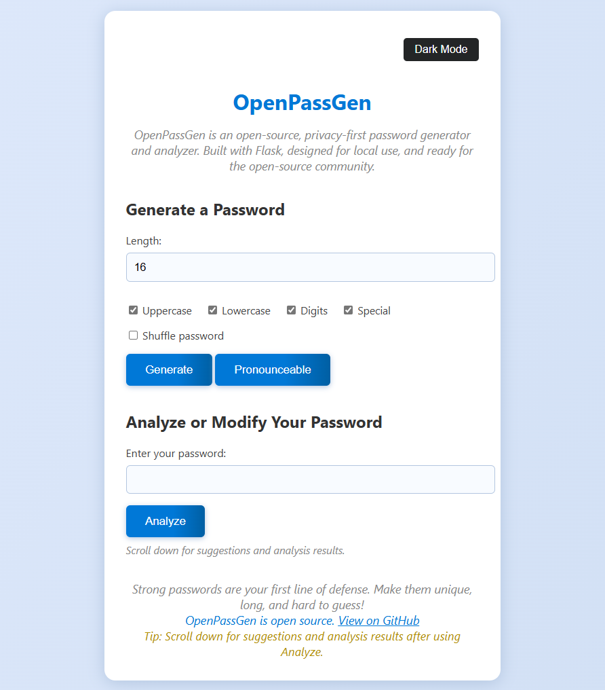

# OpenPassGen

OpenPassGen is a modern, open-source, privacy-first password generator and analyzer web app built with Python Flask. It is designed for local use, with a beautiful, responsive UI and a focus on security and usability. No passwords are ever sent over the internet.

## Features

- **Strong Password Generation**: Create secure passwords with customizable options (length, uppercase, lowercase, digits, special characters).
- **Password Strength Meter**: Visual feedback on password strength.
- **Password Analysis**: Check your own password against modern security standards and get suggestions to improve it.
- **Password Variations**: Instantly generate secure variations of your own password.
- **Pronounceable Passwords**: Generate passwords that are easier to remember but still strong.
- **Shuffle Option**: Shuffle generated passwords for extra randomness.
- **Show/Hide Password**: Toggle password visibility for convenience.
- **Copy & Download**: Copy passwords to clipboard or download as a text file.
- **Password History**: See your recent generated passwords (session only, not stored).
- **Dark Mode**: Switch between light and dark themes.
- **Responsive UI**: Works great on desktop and mobile.
- **Open Source**: MIT licensed, ready for contributions!

## Screenshots

 <!-- Add your screenshot here -->

## Getting Started

### Prerequisites
- Python 3.7+
- pip

### Installation

1. **Clone the repository:**
   ```sh
   git clone https://github.com/Santoshn26/OpenPassGen.git
   cd OpenPassGen
   ```
2. **Create a virtual environment (recommended):**
   ```sh
   python -m venv .venv
   source .venv/bin/activate  # On Windows: .venv\Scripts\activate
   ```
3. **Install dependencies:**
   ```sh
   pip install -r requirements.txt
   ```
4. **Run the app:**
   ```sh
   python app.py
   ```
5. **Open your browser:**
   Go to [http://localhost:5000](http://localhost:5000)

## Usage
- Use the generator to create strong passwords with your chosen options.
- Analyze your own password and get actionable suggestions.
- Shuffle, copy, or download passwords as needed.
- Toggle dark mode for a comfortable viewing experience.
- All features work locally—no data leaves your machine.

## About
OpenPassGen is built for privacy and security enthusiasts, IT professionals, and anyone who wants to generate and analyze passwords safely and easily. Contributions, suggestions, and issues are welcome!

## License
MIT License. See [LICENSE](LICENSE) for details.

## Contributing
Pull requests are welcome! For major changes, please open an issue first to discuss what you would like to change.

## Author
- [Santosh Nc](https://github.com/Santoshn26)

---

**OpenPassGen** – Your open-source, privacy-first password generator and analyzer.

[View on GitHub](https://github.com/Santoshn26/OpenPassGen)
