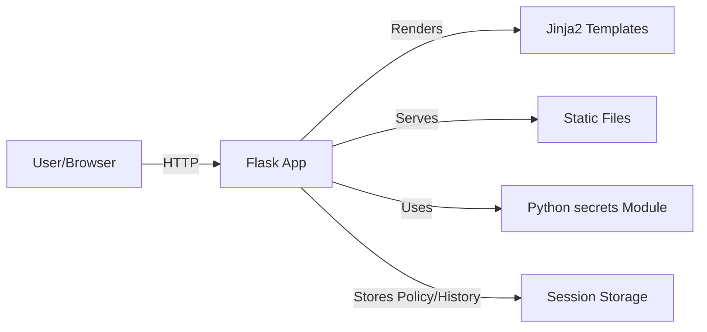

# OpenPassGen Technical Overview

## How OpenPassGen Works (Layman's Terms)

OpenPassGen is like a smart assistant that helps you make, check, and improve passwords—all on your own computer. Here’s how it works in simple terms:

- **You open the app in your web browser.**
- **You tell it what kind of password you want** (how long, what types of characters, etc.) and click the big Generate button.
- **The app creates a strong password for you instantly.** It never sends your password or choices to the internet—everything happens on your device.
- **You can check how strong your own password is.** Just type it in, and the app will tell you if it’s good, how hard it is to crack, and how to make it better.
- **You can set your own password rules.** For example, you can require special characters or avoid confusing letters.
- **You can see different versions of your password,** get tips for staying safe, and even copy or download your passwords easily.
- **The app remembers your recent passwords** (just while it’s open), but never saves them permanently.

**If you want to change how the app works:**
- All the code is open and easy to read. You can change how passwords are made, add new features, or update the look.
- The main logic is in `app.py` (the brain), and the web page is in `templates/index.html` (the face).
- You don’t need to be a Python expert—just follow the comments and structure in the files.

---

## 1. How the App Works

OpenPassGen is a Flask-based web application for generating, analyzing, and customizing strong passwords. It runs locally, ensuring privacy and security. The app provides a modern, responsive UI and a variety of password tools, all processed on your device.

### Main Features Workflow
- **Password Generation:** User selects options (length, character types, shuffle, pronounceable, etc.) and clicks Generate. The backend creates a password based on these options and returns it to the UI.
- **Password Analysis:** User enters a password for analysis. The backend checks it against the current policy, estimates entropy/crack time, and provides suggestions.
- **Password Policy:** Users can set custom password requirements (min length, required types, exclude similar chars). These are used for both generation and analysis.
- **Password Variations:** The app generates secure variations of a given password for convenience.
- **Security Tips:** The UI displays best practices and reputable links.
- **Password History:** Recent generated passwords are shown (session only, not stored).

## 2. Coding Logic & Structure

- **Flask App (`app.py`):**
  - Handles all routes (index, generate, analyze, download, etc.).
  - Uses Flask sessions to persist user policy and history.
  - Password generation uses Python's `secrets` for cryptographic randomness.
  - Entropy and crack time are estimated using combinatorics and standard formulas.
  - Jinja2 templates render the UI, passing all results and options.

- **Templates (`templates/index.html`):**
  - Responsive, modern HTML/CSS with dark mode and accessibility features.
  - Uses Jinja2 templating for dynamic content.
  - JavaScript for UI interactivity (copy, show/hide, etc.).

- **Static Files (`static/`):**
  - Logo, manifest, service worker (PWA support, currently disabled).

- **Containerization:**
  - Dockerfile and docker-compose.yml for easy deployment.

## 3. Workflow Diagram (Markdown Diagram)

```mermaid
graph TD
    User[User]
    Browser[Browser]
    Flask[Flask App]
    Policy[Password Policy]
    Gen[Password Generation]
    Analyze[Password Analysis]
    Variations[Password Variations]
    History[Password History (Session)]
    UI[UI/Results]

    User -->|"Select options / Enter password"| Browser
    Browser -->|"Request"| Flask
    Flask -->|"Apply Policy"| Policy
    Flask -->|"Generate Password"| Gen
    Flask -->|"Analyze Password"| Analyze
    Flask -->|"Create Variations"| Variations
    Flask -->|"Update History"| History
    Gen --> UI
    Analyze --> UI
    Variations --> UI
    History --> UI
    Policy --> UI
    Flask --> UI
    UI --> Browser
    Browser --> User
```

## 4. Architecture Diagram (Markdown Diagram)



## 5. Security & Privacy
- All password logic runs locally; no data leaves your device.
- Uses cryptographically secure random generation.
- No passwords are stored or logged.
- Open source for transparency.

---

For more details, see the main README.md or the source code.
